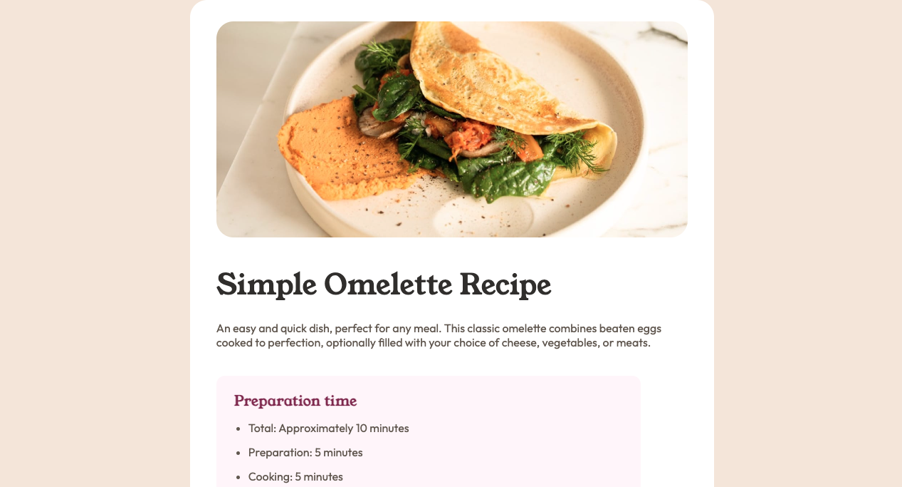

# Frontend Mentor - Recipe page solution

This is a solution to the [Recipe page challenge on Frontend Mentor](https://www.frontendmentor.io/challenges/

## Table of contents

- [Overview](#overview)
  - [The challenge](#the-challenge)
  - [Screenshot](#screenshot)
  - [Links](#links)
- [My process](#my-process)
  - [Built with](#built-with)
- [Author](#author)

## Overview

### Screenshot

### Links

- Solution URL: [Github](https://github.com/darrylrachel/fm-recipe-page)
- Live Site URL: [Recipe Page](https://project-recipe-page.netlify.app/)

## My process

### Built with

- Semantic HTML5 markup
- CSS custom properties
- Flexbox
- CSS Grid
- Mobile-first workflow

## Author

- Website - [Darryl Rachel](https://trbllabs.com/)
- Frontend Mentor - [@darrylrachel](https://www.frontendmentor.io/profile/darrylrachel)
- Twitter - [@darryldevydev](https://www.twitter.com/darryldevydev)
